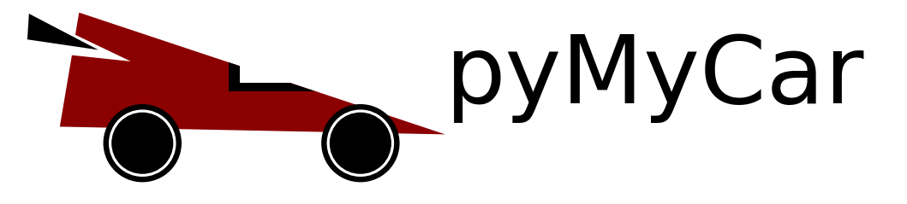

Welcome to **pyMyCar** !

Introduction
============
Welcome to the `pyMyCar` package documentation! This package provides comprehensive tools and resources for analyzing vehicle dynamics. Whether you're an automotive engineer, researcher, or car enthusiast, `pyMyCar` empowers you to understand, simulate, and optimize the intricate interactions between different vehicle components and their dynamic behavior.

Contributions and Feedback
--------------------------
We welcome contributions and feedback from the community to enhance the code's functionality, reliability, and user experience.To get started, please review our `Contributing Guidelines <https://pymycar.readthedocs.io/en/latest/extras/DeveloperNotes/main.html>`_ to share your insights and collaborate with fellow developers.

Thank you for choosing our Phase-Field Fracture simulation code. We trust this tool will prove invaluable in advancing your understanding of fracture mechanics and its practical applications.

Contributing
============

Contributions from the community are warmly welcomed to enrich and expand the capabilities of `pyMyCar`. Whether you're enhancing documentation, introducing new features, or addressing bugs, your contributions are invaluable. For details, please visit the GitHub repository and the contribution guidelines.

Documentation: https://your-package-docs-link.com
GitHub Repository: https://github.com/your-username/pyMyCar

License
========

This package is distributed under the MIT License. See the `LICENSE` file for more information.

.. raw:: html

   

       
Contact us at <a href="mailto:contact@yourdomain.com">contact@yourdomain.com</a> for inquiries and feedback.

   

Contributions and Feedback
--------------------------
We welcome contributions and feedback from the community to enhance the code's functionality, reliability, and user experience. Feel free to engage with us through our [GitHub repository](https://github.com/CastillonMiguel/pymycar) and share your insights.

.. toctree::

   getting-started/index
   theory/index
   api/index
   auto_examples/index
   extras/index