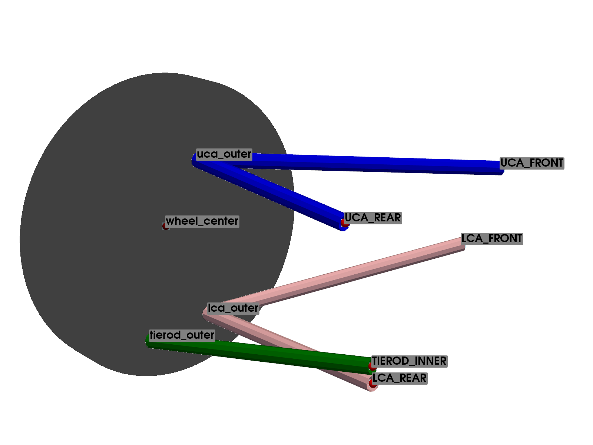
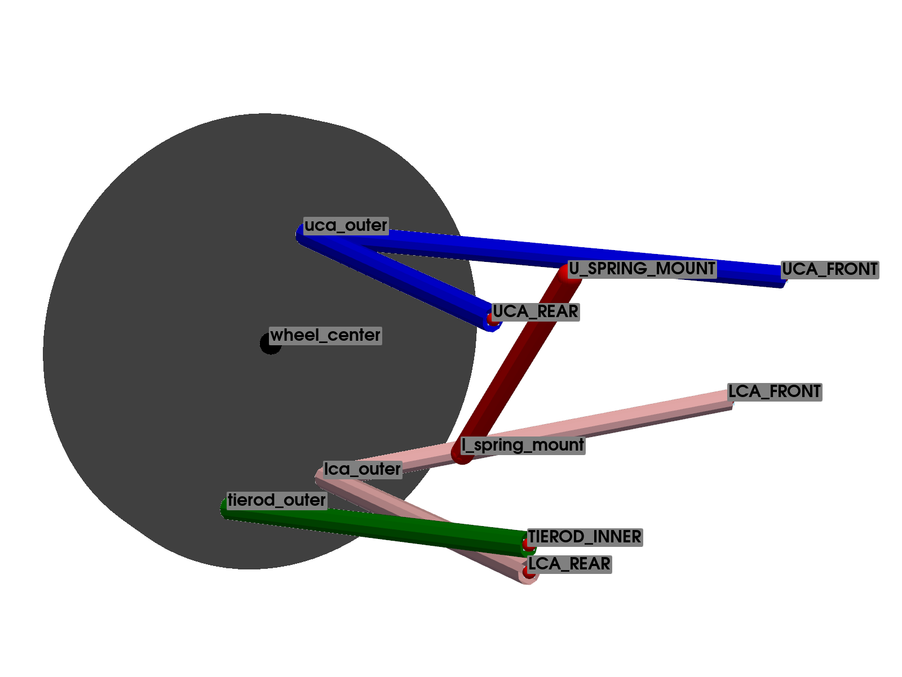
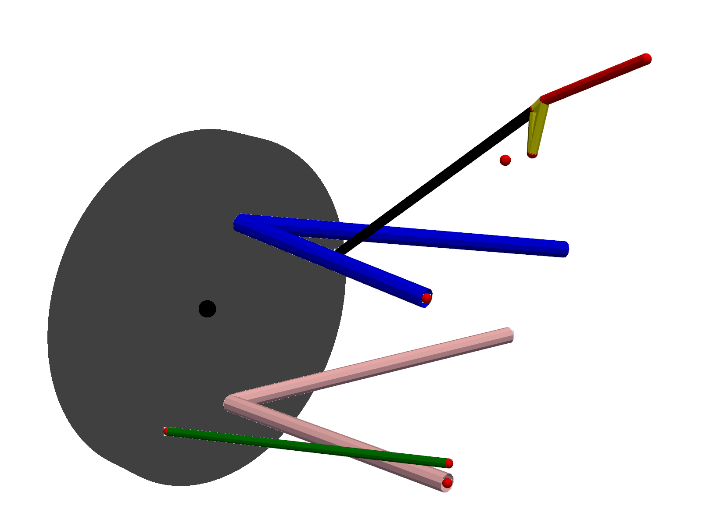
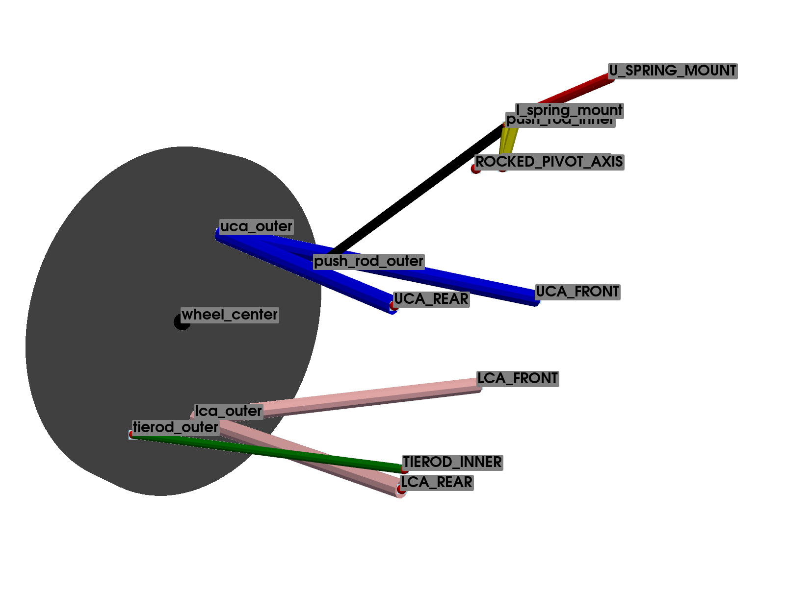
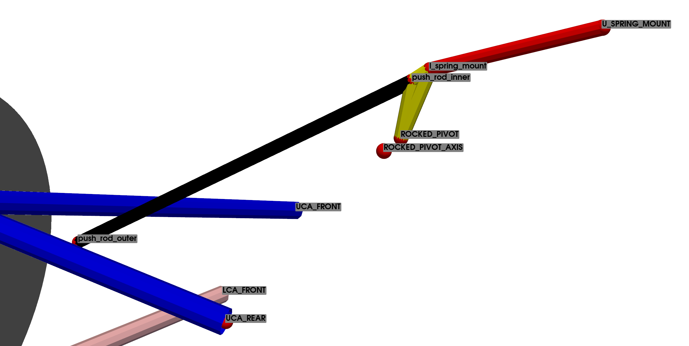

.. _double_whisbone_suspension:

Double Wishbone Suspension
==========================

This type of suspension is widely used in various vehicles, from road cars to competition vehicles.

The position of the spring and damper in the suspension system can be adapted to various configurations, meaning they can be placed between different elements of the system.

Initially, we will analyze the base kinematics without the spring and damper system. This approach allows us to study a simpler system, verifying and understanding its operation, and able to study the positions and orientation of the wheel under study. Later, we will develop complete systems with various spring/damper configurations by slightly increasing the complexity of the initially defined system.

Key Components
^^^^^^^^^^^^^^

* **Upper Control Arm (UCA)**: The upper wishbone or control arm connects the upper part of the wheel hub to the vehicle chassis. It helps control the vertical movement of the wheel and maintains the wheel's alignment.

* **Lower Control Arm (LCA)**: The lower wishbone or control arm connects the lower part of the wheel hub to the vehicle chassis. It works in conjunction with the upper control arm to manage the wheel's movement and alignment.

* **Knuckle or Upright**: This component connects the upper and lower control arms to the wheel hub. It allows the wheel to pivot for steering and supports the wheel bearings.

* **Tie Rod**: In the case of front suspensions, the tie rod connects the steering rack to the wheel hub, allowing for steering input to be transmitted to the wheels.

* **Spring and Damper**: These components are crucial for absorbing shocks and maintaining ride comfort. The position of the spring and damper in the suspension system can be adapted to various configurations, meaning they can be placed between different elements of the system.

Configuration: Base
-------------------

.. note::
    For further details on the CAD example representation of the double wishbone suspension, see the function :py:func:`pymycar.Cad.Suspension.double_whisbone.whisbone_cad_base`.

The base system of the Double Wishbone suspension is defined using 9 points, as presented in :ref:`table_points_description_doble_whisbone_base`. Of these, 5 points represent the vehicle chassis and are considered fixed, as the kinematic analysis is relative to these coordinates.

By convention, chassis points (fixed points) are named with letters (*UCA FRONT, UCA REAR, LCA FRONT, LCA REAR*), while mobile points are named with numbers (*uca outer, lca outer, tierod outer, wheel center*). This convention is used in all analyses. This standard definition uses *Lca* (lower control arm) and *Uca* (upper control arm).

The *TIEROD INNER* point refers to the steering system (or toe link in the case of rear suspension), which is considered fixed in the analysis. Therefore, the system has a single degree of freedom, requiring a total of 11 constraint equations. To account for the steering behavior, several analyses must be conducted by varying this point's coordinates.

.. _table_points_description_doble_whisbone_base:

.. table:: Points Defining the Base Wishbone Suspension

   +-----------------+--------------------------+--------+
   | Points  Name    | Description              | Type   |
   +=================+==========================+========+
   | wheel center    | Center of the Wheel      | mobile |
   +-----------------+--------------------------+--------+
   | UCA FRONT       | Upper Control Arm Front  | fixed  |
   +-----------------+--------------------------+--------+
   | UCA REAR        | Upper Control Arm Rear   | fixed  |
   +-----------------+--------------------------+--------+
   | uca outer       | Upper Control Arm Outer  | mobile |
   +-----------------+--------------------------+--------+
   | LCA FRONT       | Lower Control Arm Front  | fixed  |
   +-----------------+--------------------------+--------+
   | LCA REAR        | Lower Control Arm Rear   | fixed  |
   +-----------------+--------------------------+--------+
   | lca outer       | Lower Control Arm Outer  | mobile |
   +-----------------+--------------------------+--------+
   | TIEROD INNER    | Inner Tie Rod            | fixed  |
   +-----------------+--------------------------+--------+
   | tierod outer    | Outer Tie Rod            | mobile |
   +-----------------+--------------------------+--------+

The 11 constraint equations necessary to define the system are presented in table :ref:`table_constrains_equations_doble_whisbone_base`.

Note that all the constraint equations are based on the distance between two points, defined as the square root of the sum of the squares of the differences of the coordinates of the points. With this type of constraint equation, combining several types, it is possible to define the wishbones, tie rod, and all the components. The constraint equations will be represented as explained in :ref:`section-convention-contrains`.

.. _table_constrains_equations_doble_whisbone_base:

.. table:: Constraint Equations: Base Wishbone Suspension

    +---------+--------------------+-----------------+-----------------+
    |Equation | Part Definition    | Initial Point   | Final Point     |
    +=========+====================+=================+=================+
    | 1       | Upper Wishbone     | uca outer       | UCA FRONT       |
    +---------+--------------------+-----------------+-----------------+
    | 2       |                    | uca outer       | UCA REAR        |
    +---------+--------------------+-----------------+-----------------+
    | 3       | Lower Wishbone     | lca outer       | LCA FRONT       |
    +---------+--------------------+-----------------+-----------------+
    | 4       |                    | lca outer       | LCA REAR        |
    +---------+--------------------+-----------------+-----------------+
    | 5       | Tie Rod            | tierod outer    | TIEROD INNER    |
    +---------+--------------------+-----------------+-----------------+
    | 6       | Knuckle            | tierod outer    | uca outer       |
    +---------+--------------------+-----------------+-----------------+
    | 7       |                    | tierod outer    | lca outer       |
    +---------+--------------------+-----------------+-----------------+
    | 8       |                    | lca outer       | uca outer       |
    +---------+--------------------+-----------------+-----------------+
    | 9       | Wheel Center       | wheel center    | uca outer       |
    +---------+--------------------+-----------------+-----------------+
    | 10      |                    | wheel center    | lca outer       |
    +---------+--------------------+-----------------+-----------------+
    | 11      |                    | wheel center    | tierod outer    |
    +---------+--------------------+-----------------+-----------------+

Configuration: 1
----------------

.. note::
    For further details on the CAD example representation of the double wishbone suspension, see the function :py:func:`pymycar.Cad.Suspension.double_whisbone.whisbone_cad_configuration_1`.

In this configuration, the spring-damper assembly, is introduced. The lower point of the suspension (*l spring mount*) is connected to the lower wishbone. The other end (*U SPRING MOUNT*) is connected directly to the vehicle chassis.

The system is defined using a total of 11 points, of which 5 represent the vehicle chassis and are considered fixed. It can be observed that the definition of this configuration is identical to that used to define the base system, with the addition of the connection point between the suspension and the lower wishbone (*l spring mount*), as well as the point *U SPRING MOUNT*, which fixes the other end of the suspension to the vehicle chassis, which will not influence the kinematic analysis.

Therefore, the system has a total of 5 mobile points, resulting in a total of 15 natural coordinates.

Again, the system has a single degree of freedom. Thus, a total of 14 constraint equations will be necessary. Of these, 11 equations represent the base of the suspension system, and the remaining 3 define the position of the point *l spring mount* on the lower wishbone.

.. _table_points_description_doble_whisbone_configuration_1:

.. table:: Points Defining the Wishbone Suspension Configuration 1

    +-----------------+--------------------------+--------+
    | Points  Name    | Description              | Type   |
    +=================+==========================+========+
    | wheel center    | Center of the Wheel      | mobile |
    +-----------------+--------------------------+--------+
    | UCA FRONT       | Upper Control Arm Front  | fixed  |
    +-----------------+--------------------------+--------+
    | UCA REAR        | Upper Control Arm Rear   | fixed  |
    +-----------------+--------------------------+--------+
    | uca outer       | Upper Control Arm Outer  | mobile |
    +-----------------+--------------------------+--------+
    | LCA FRONT       | Lower Control Arm Front  | fixed  |
    +-----------------+--------------------------+--------+
    | LCA REAR        | Lower Control Arm Rear   | fixed  |
    +-----------------+--------------------------+--------+
    | lca outer       | Lower Control Arm Outer  | mobile |
    +-----------------+--------------------------+--------+
    | TIEROD INNER    | Inner Tie Rod            | fixed  |
    +-----------------+--------------------------+--------+
    | tierod outer    | Outer Tie Rod            | mobile |
    +-----------------+--------------------------+--------+
    | U SPRING MOUNT  | Spring/damper            | fixed  |
    |                 | Upper Mount              |        |
    +-----------------+--------------------------+--------+
    | l spring mount  | Spring/Damper            | mobile |
    |                 | Lower Mount              |        |
    +-----------------+--------------------------+--------+

.. _table_constrains_equations_doble_whisbone_configuration_1:

.. table:: Constraint Equations: Configuration 1 Double Wishbone Suspension

    +---------+--------------------+-----------------+-----------------+
    |Equation | Part Definition    | Initial Point   | Final Point     |
    +=========+====================+=================+=================+
    | 1       | Upper Wishbone     | uca outer       | UCA FRONT       |
    +---------+--------------------+-----------------+-----------------+
    | 2       |                    | uca outer       | UCA REAR        |
    +---------+--------------------+-----------------+-----------------+
    | 3       | Lower Wishbone     | lca outer       | LCA FRONT       |
    +---------+--------------------+-----------------+-----------------+
    | 4       |                    | lca outer       | LCA REAR        |
    +---------+--------------------+-----------------+-----------------+
    | 5       | Tie Rod            | tierod outer    | TIEROD INNER    |
    +---------+--------------------+-----------------+-----------------+
    | 6       | Knuckle            | tierod outer    | uca outer       |
    +---------+--------------------+-----------------+-----------------+
    | 7       |                    | tierod outer    | lca outer       |
    +---------+--------------------+-----------------+-----------------+
    | 8       |                    | lca outer       | uca outer       |
    +---------+--------------------+-----------------+-----------------+
    | 9       | Wheel Center       | wheel center    | uca outer       |
    +---------+--------------------+-----------------+-----------------+
    | 10      |                    | wheel center    | lca outer       |
    +---------+--------------------+-----------------+-----------------+
    | 11      |                    | wheel center    | tierod outer    |
    +---------+--------------------+-----------------+-----------------+
    | 12      | Point Suspension   | l spring mount  | LCA FRONT       |
    |         | Lower Wishbone     |                 |                 |
    +---------+--------------------+-----------------+-----------------+
    | 13      |                    | l spring mount  | LCA REAR        |
    +---------+--------------------+-----------------+-----------------+
    | 14      |                    | l spring mount  | lca outer       |
    +---------+--------------------+-----------------+-----------------+
 

Configuration: 2
----------------

.. note::
    For further details on the CAD example representation of the double wishbone suspension, see the function :py:func:`pymycar.Cad.Suspension.double_whisbone.whisbone_cad_configuration_2`.

In this configuration, the suspension is connected to a rocker that is actuated by a rod, which has its other end connected to the upper wishbone of the system.

.. image:: images/configuration_2.png
    :alt: Double Wishbone Suspension: Base Configuration 2
    :align: center

The lower point of the suspension (*l spring mount*) is connected to the rocker. The other end (*UPPER SPRING MOUT*) is anchored to the vehicle chassis.

The system is defined using a total of 15 points, of which 8 represent the vehicle chassis and are considered fixed. This gives a total of 21 natural coordinates, corresponding to the $x, y, z$ coordinates of each of the 7 mobile points. Again, this configuration starts from the definition used in the base system description.

A total of 20 constraint equations will be necessary, as there are 21 variables and a single degree of freedom. Of these, eleven equations represent the base of the suspension system, and the remaining 9 define the position of point *pushrod outer*, located on the upper wishbone, the rod connecting the upper wishbone to the rocker, defined by points *pushrod outer* and $pushrod inner$, the rocker defined by points *ROCKER PIVOT*, *ROCKER PIVOT AXIS*, and $Pushrod Inner$, as well as the point *l spring mount*, which connects to the suspension, and the point *U SPRING MOUNT*, which connects the other end of the suspension.

.. _table_points_description_doble_whisbone_configuraton_2:

.. table:: Points Defining the Wishbone Suspension Configuration 2

    +-----------------+--------------------------+--------+
    | Points  Name    | Description              | Type   |
    +=================+==========================+========+
    | wheel center    | Center of the Wheel      | mobile |
    +-----------------+--------------------------+--------+
    | UCA FRONT       | Upper Control Arm Front  | fixed  |
    +-----------------+--------------------------+--------+
    | UCA REAR        | Upper Control Arm Rear   | fixed  |
    +-----------------+--------------------------+--------+
    | uca outer       | Upper Control Arm Outer  | mobile |
    +-----------------+--------------------------+--------+
    | LCA FRONT       | Lower Control Arm Front  | fixed  |
    +-----------------+--------------------------+--------+
    | LCA REAR        | Lower Control Arm Rear   | fixed  |
    +-----------------+--------------------------+--------+
    | lca outer       | Lower Control Arm Outer  | mobile |
    +-----------------+--------------------------+--------+
    | TIEROD INNER    | Inner Tie Rod            | fixed  |
    +-----------------+--------------------------+--------+
    | tierod outer    | Outer Tie Rod            | mobile |
    +-----------------+--------------------------+--------+
    | pushrod outer   | Pushrod Exterior         | mobile |
    +-----------------+--------------------------+--------+
    | pushrod inner   | Pushrod Interior         | mobile |
    +-----------------+--------------------------+--------+
    | ROCKER PIVOT    | Rocker pivot             | fixed  |
    +-----------------+--------------------------+--------+
    | ROCKER PIVOT    | Rocker pivot axis        | fixed  |
    | AXIS            |                          |        |
    +-----------------+--------------------------+--------+
    | U SPRING MOUNT  | Spring/damper            | fixed  |
    |                 | Upper Mount              |        |
    +-----------------+--------------------------+--------+
    | l spring mount  | Spring/Damper            | mobile |
    |                 | Lower Mount              |        |
    +-----------------+--------------------------+--------+

There are a total of 20 constraint equations presented in the table :ref:`table_constrains_equations_doble_whisbone_configuration_2`. Again, the first eleven are the same as those used to define the base system.

The equations 1 to 3 define the position of the connection point between the pushrod and the upper wishbone. Equation 4 introduces the condition of constant length of the pushrod. Equations 5 and 6 define the rigid condition of the rocker. It should be noted that the point *ROCKER PIVOT* is the one that actually connects to the chassis, while *ROCKER PIVOT AXIS* is an auxiliary point used to define the direction of rotation of the rocker. In other words, a revolute pair has been defined by combining these points. Finally, equations 7 to 9 define the position of point *pushrod inner*, which connects to the lower end of the suspension.

.. _table_constrains_equations_doble_whisbone_configuration_2:

.. table:: Constraint Equations: Configuration 2 Wishbone Suspension

    +---------+--------------------+-----------------+------------------+
    |Equation | Part Definition    | Initial Point   | Final Point      |
    +=========+====================+=================+==================+
    | 1       | Upper Wishbone     | uca outer       | UCA FRONT        |
    +---------+--------------------+-----------------+------------------+
    | 2       |                    | uca outer       | UCA REAR         |
    +---------+--------------------+-----------------+------------------+
    | 3       | Lower Wishbone     | lca outer       | LCA FRONT        |
    +---------+--------------------+-----------------+------------------+
    | 4       |                    | lca outer       | LCA REAR         |
    +---------+--------------------+-----------------+------------------+
    | 5       | Tie Rod            | tierod outer    | TIEROD INNER     |
    +---------+--------------------+-----------------+------------------+
    | 6       | Knuckle            | tierod outer    | uca outer        |
    +---------+--------------------+-----------------+------------------+
    | 7       |                    | tierod outer    | lca outer        |
    +---------+--------------------+-----------------+------------------+
    | 8       |                    | lca outer       | uca outer        |
    +---------+--------------------+-----------------+------------------+
    | 9       | Wheel Center       | wheel center    | uca outer        |
    +---------+--------------------+-----------------+------------------+
    | 10      |                    | wheel center    | lca outer        |
    +---------+--------------------+-----------------+------------------+
    | 11      |                    | wheel center    | tierod outer     |
    +---------+--------------------+-----------------+------------------+
    | 12      | Pushrod point mount| pushrod outer   | UCA FRONT        |
    +---------+--------------------+-----------------+------------------+
    | 13      |                    | pushrod outer   | UCA REAR         |
    +---------+--------------------+-----------------+------------------+
    | 14      |                    | pushrod outer   | uca outer        |
    +---------+--------------------+-----------------+------------------+
    | 15      | Constant distance  | pushrod inner   | pushrod outer    |
    +---------+--------------------+-----------------+------------------+
    | 16      | Rocker             | pushrod inner   | ROCKER PIVOT     |
    +---------+--------------------+-----------------+------------------+
    | 17      |                    | pushrod inner   | ROCKER PIVOT AXIS|
    +---------+--------------------+-----------------+------------------+
    | 18      | Suspension Point   | l spring mount  | UCA FRONT        |
    +---------+--------------------+-----------------+------------------+
    | 19      |                    | l spring mount  | ROCKER PIVOT     |
    +---------+--------------------+-----------------+------------------+
    | 20      |                    | l spring mount  | pushrod inner    |
    +---------+--------------------+-----------------+------------------+
