Variables Relative to the Suspension System
===========================================

Once the kinematic problem of a given suspension system is resolved, it becomes possible to calculate a series of characteristic curves.

This section outlines the definitions and procedures followed for each variable.

.. note::

   The coordinates used to define the points of various suspension systems are negative when referring to the vehicle's left suspension (the one closest to the driver's left arm) and positive for the right suspension.

The wheel is considered as a rigid body, so it present a 6 degrees of freedom (DOF) movement. 

Relative to Wheel Orientation
-----------------------------

The following variables are relatives to the wheel's orientation in space.

Camber Angle
^^^^^^^^^^^^
The **Camber angle** is defined as the angle formed between the wheel plane and the vertical axis of the vehicle. It is considered positive when the top of the wheel tilts outward from the vehicle's chassis.

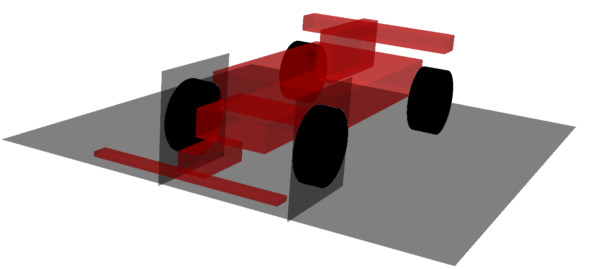

   Camber Neutral

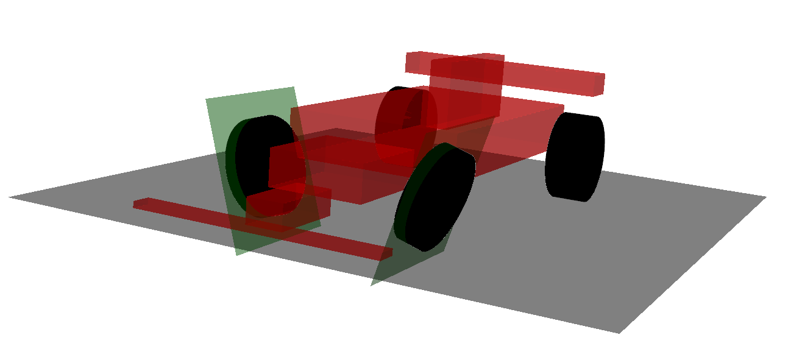

   Camber Positive

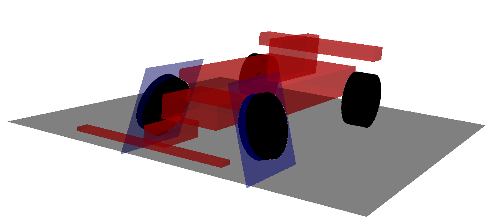

   Camber Negative

Toe Angle
^^^^^^^^^
The **Toe angle** is the angle formed between the vehicle's longitudinal axis and the wheel's center plane. It is positive if the front of the wheel turns toward the vehicle's chassis.

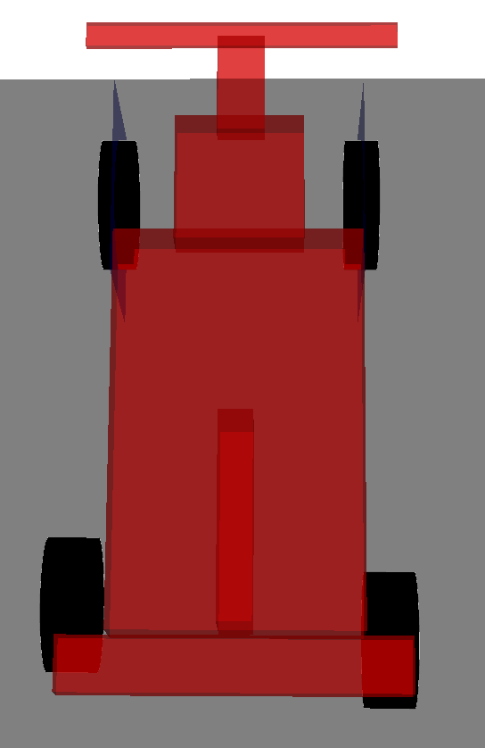

   Toe Neutral

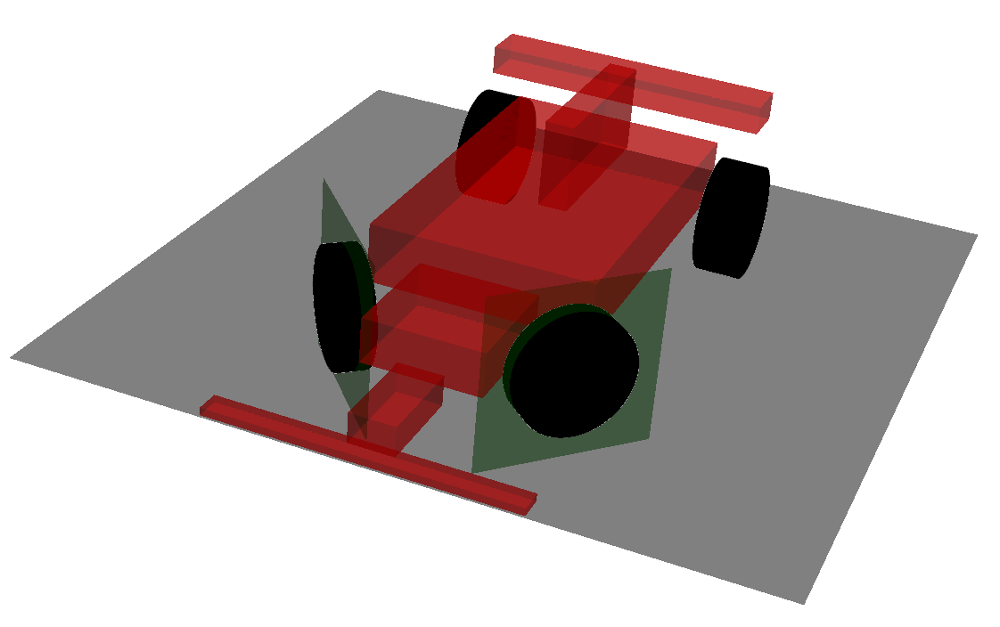

   Toe Positive

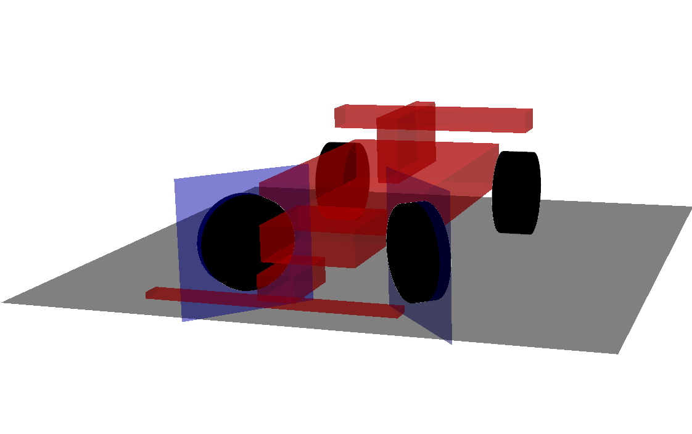

   Toe Negative

Side-View Angle
^^^^^^^^^^^^^^^
The **Side-View angle** (or lateral view angle) refers to the rotation angle of the wheel. It is positive for clockwise rotation.

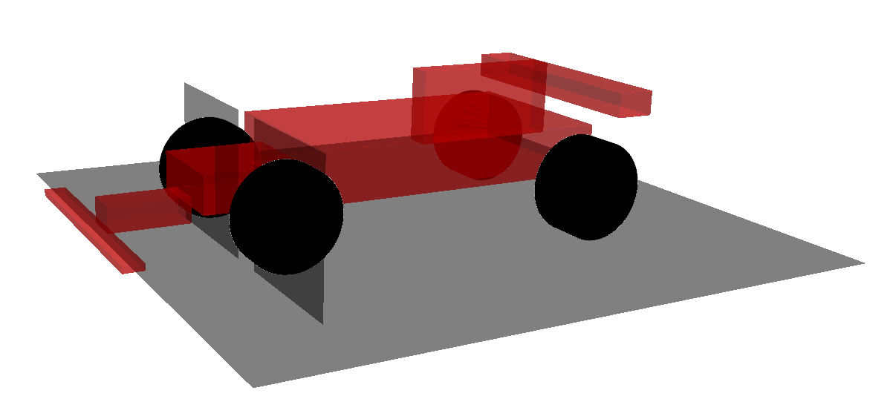

   Side-View Neutral

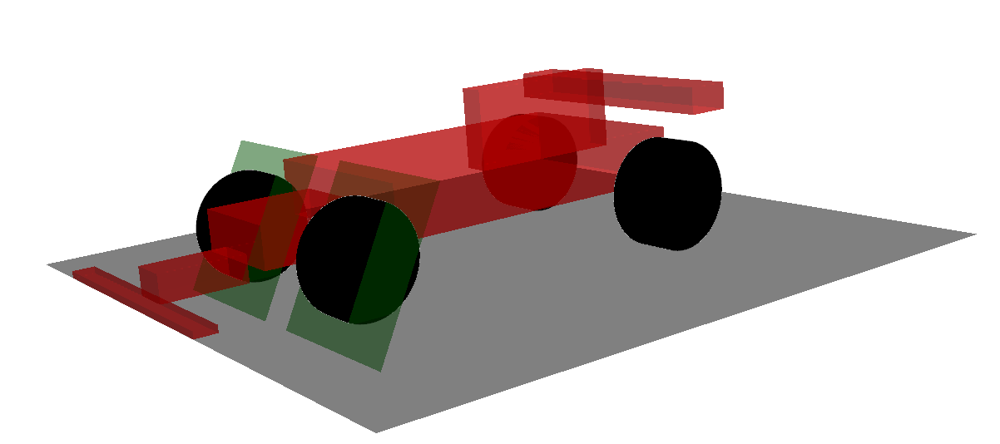

   Side-View Positive

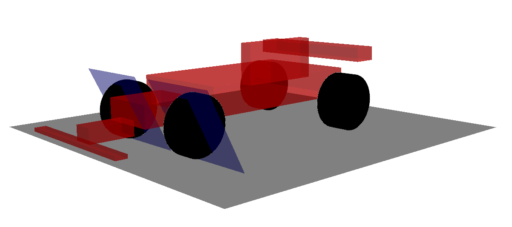

   Side-View Negative

.. note::

   **Calculation: Camber, Toe, Side-View** 
   In all the kinematic analyses performed previously, the knuckle (the element that connects to the wheel) has been defined with a minimum of 3 points. Thanks to this, it is possible to determine the spatial transformation matrix of this element for all the studied positions. Subsequently, the equivalent Euler matrix can be calculated, and from it, the corresponding wheel rotation angles, i.e., the angles of \textit{Camber, Toe, and Side-View}.

   - Calculation of the general rotation matrix

   The knuckle has been defined with a minimum of 4 points in both suspension systems, making it possible to obtain 3 vectors representing each of the three directions, as follows (they must be non-coplanar):
   
   .. math:: 

      v_1=P_2-P_1

      v_2=P_3-P_2

      v_3=P_4-P_3

   And it can be expressed in matrix form as:
   
   .. math:: 

      X=[ v_1,  v_2,  v_3]    

   The local coordinate matrix (constant) is defined from the initial values given to define the system, i.e., taking the points $P1, P2, P3,$ and $P4$ introduced as data for the definition.

   .. math::

      X_{constant}=[Vc_1, Vc_2, Vc_3]    

   The rotation matrix relates the local and general coordinates as follows:

   .. math:: 
      [X]=R*[Xc]

   Therefore, the rotation matrix [R] can be represented as:

   .. math:: 

      R=X*{[Xc]^{-1}}

   The local coordinate matrix is constant throughout the simulation, so it will be sufficient to invert the matrix only once, thus achieving greater computational efficiency.

   Knowing the general coordinates of the points throughout the simulation, the general rotation matrix corresponding to each of the studied positions can be calculated.

   .. math:: 
      
      R=\begin{bmatrix}
      R_{11} &    R_{12} & R_{13}\\
      R_{21} &    R_{22} & R_{23}\\
      R_{31} &    R_{32} & R_{33}
      \end{bmatrix}

   - Determination of the angles from the general rotation matrix

   Once the general rotation matrix is obtained for each of the studied positions, the calculation of the equivalent Euler angles of that matrix proceeds.

   The general rotation matrix can be defined as a sequence of 3 rotations, each around each axis. It is important to note that matrix multiplication is not commutative. For this case, the Z-Y-X rotation sequence is used.

   The rotation matrices in the principal axes are defined as:

   .. math:: 

      R_x(\psi)=\begin{bmatrix}
      1 &       0 &        0\\
      0 & \cos{\psi} & -\sin{\psi}\\
      0 & \sin{\psi} &  \cos{\psi}
      \end{bmatrix}

   .. math:: 
      R_y(\theta)=\begin{bmatrix}
      \cos{\theta} &    0 &\sin{\theta}\\
      0 &          1 &    0\\
      -\sin{\theta} &   0 & \cos{\theta}
      \end{bmatrix}

   .. math:: 
      R_z(\phi)=\begin{bmatrix}
      \cos{\phi} & -\sin{\phi} & 0\\
      \sin{\phi} &  \cos{\phi} & 0\\
               0 &           0 & 1
      \end{bmatrix}

   Then, given the matrix R, the Euler angles can be calculated by equating each term of the matrix with its corresponding term in the resulting matrix $R_{euler}$ calculated with the described rotation sequence, $R_{euler}=R_z(\delta) \cdot R_y(\alpha) \cdot R_x(\gamma)$, resulting in a system of nine equations. Note that rotation matrices are orthonormal, meaning the inverse of a rotation matrix is equal to its transpose.

Relative to Wheel Position
--------------------------

The following variables are relatives to the wheel's position in space.

The following variables define the displacement of the wheel center along each of the $x$, $y$, and $z$ axes. This corresponds to the projection of the total displacement in the $X$, $Y$, and $Z$ planes. These values are calculated as the difference between the reference position and the coordinates used to define the wheel center's position in the system.

Wheel Base
^^^^^^^^^^
**Wheel base** refers to the longitudinal displacement of the wheel center. It is positive when the displacement is forward.

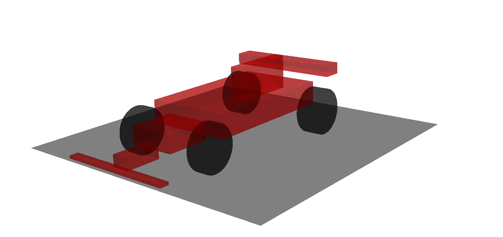

   Wheel Base Reference

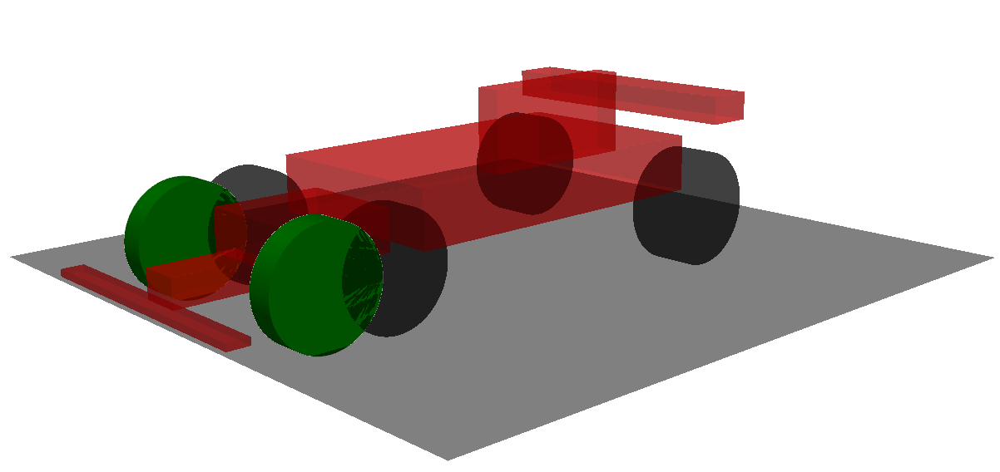

   Wheel Base Positive

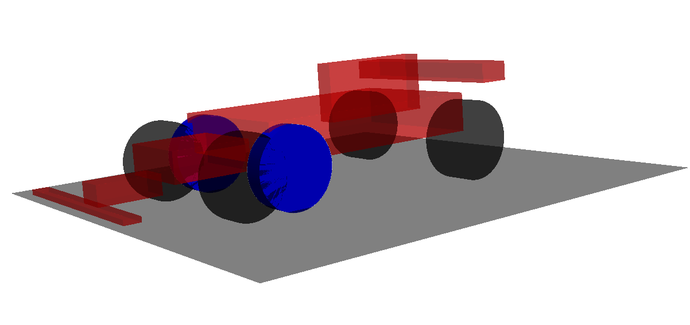

   Wheel Base Negative

Wheel Track
^^^^^^^^^^^
**Wheel track** is the lateral displacement of the wheel center. It is positive when the displacement is outward.

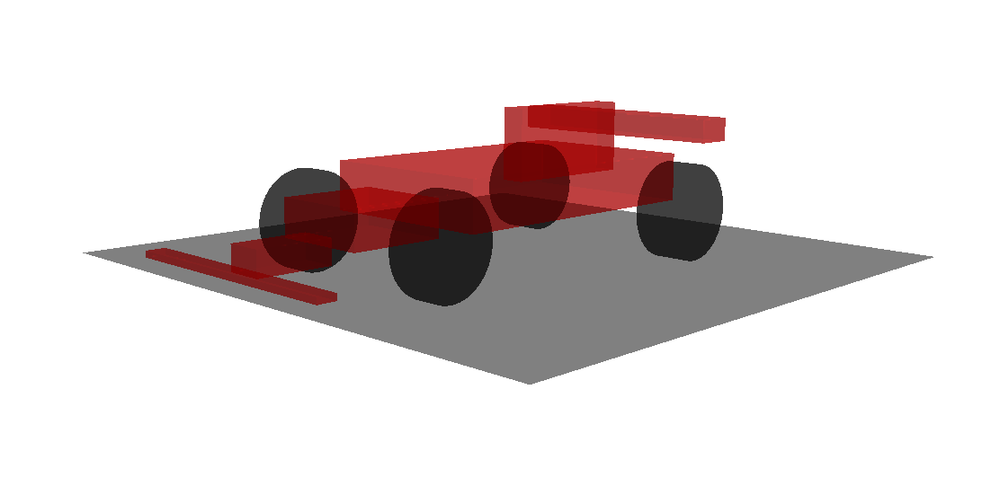

   Wheel Track Reference

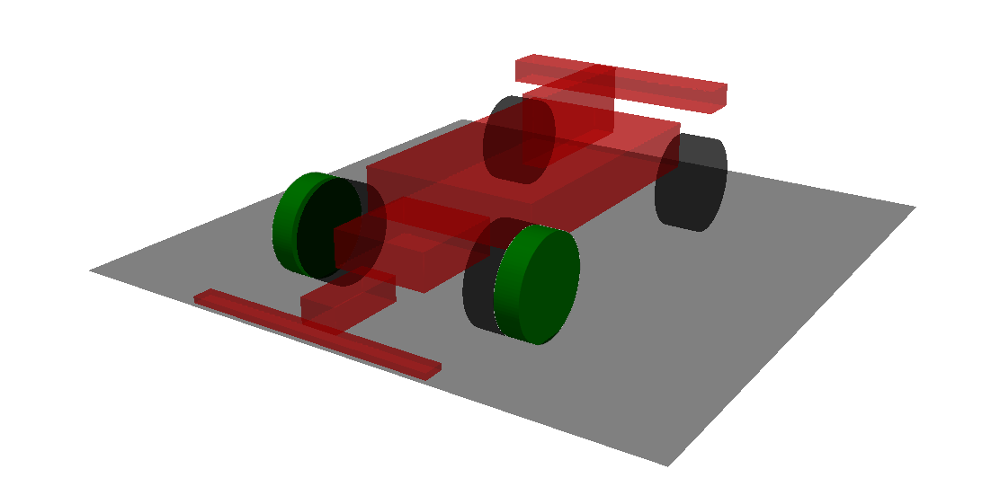

   Wheel Track Positive

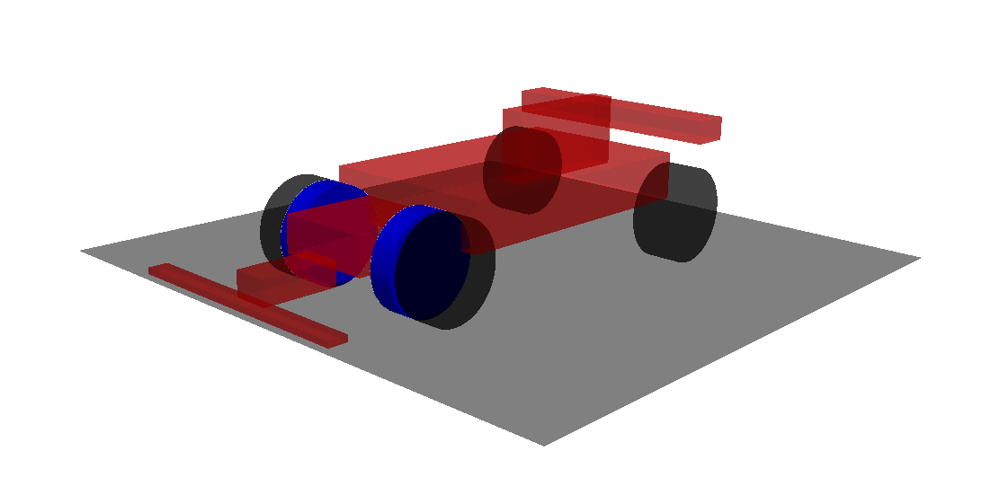

   Wheel Track Negative

Wheel Jounce
^^^^^^^^^^^^
**Wheel jounce** is the vertical displacement of the wheel center. It is positive when the displacement is upward.

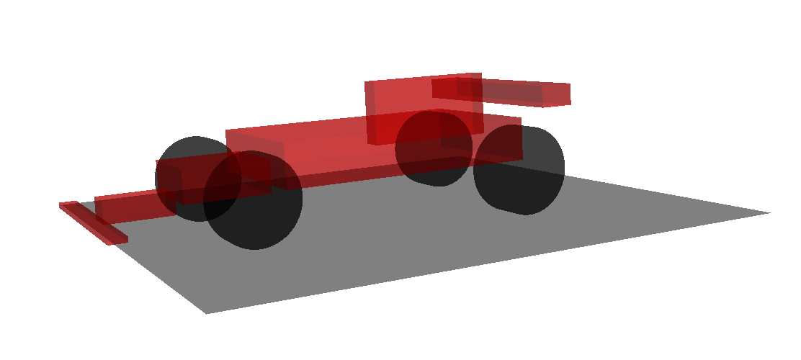

   Wheel Jounce Reference

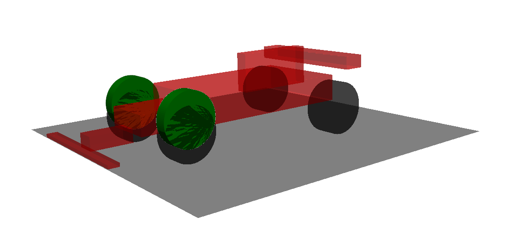

   Wheel Jounce Positive

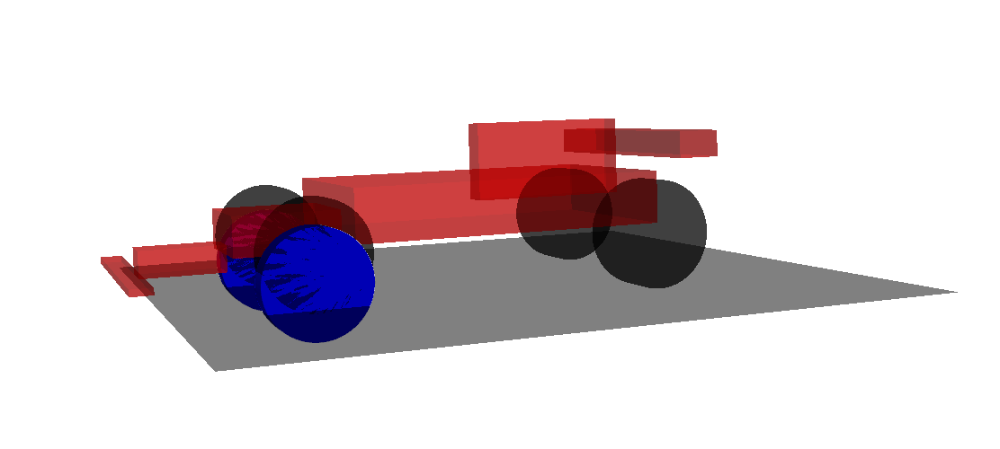

   Wheel Jounce Negative

Installation Ratio
------------------

All proposed models consider a suspension configuration where the spring and damper connect to the same elements. Therefore, the deflection of the spring and damper will be the same.

Deflection is calculated with reference to the position used in the definition of the suspension system. Positive deflection is considered for compression, and negative for extension.

The presence of a mechanism between the wheel and the suspension creates a lever effect, so the displacement produced at the wheel will be different from the displacement that actually reaches the spring/damper.

.. math::

   \lambda = \frac{d_{\text{wheel}}}{d_{\text{spring}}}

To account for this aspect, the concept of the installation ratio $\lambda$ is introduced, which represents the relationship between the vertical movement of the wheel and the movement produced in the spring/damper.

Thanks to this relationship, an equivalent system can be proposed, consisting of a spring in a vertical position. It is important to note that the installation ratio varies along the vertical displacement of the wheel, so it is necessary to consider an equivalent vertical spring, represented by a stiffness curve as a function of the vertical displacement.

The value of the equivalent vertical stiffness can be obtained as:

.. math::

   c_A = \lambda^2 c_s + \frac{d \lambda^2 c_s}{d d_{\text{wheel}}} d_{\text{wheel}}

The second term of equation [12] generally presents small values compared to those contributed by the first term. Therefore, the following approximation can be made:

.. math::
   
   c_A \approx \lambda^2 c_s 

In the case of considering a damper with a damping coefficient $b_s$, the equivalent vertical damping coefficient $b_A$ is defined by equation 3.80. Again, this will result in a curve that describes the equivalent vertical damping coefficient as a function of the vertical displacement of the wheel. It should be noted that in this case, the equivalent vertical damping is defined solely by the product of the squared installation ratio and the damping coefficient of the damper.

.. math::
   
   b_A \approx \lambda^2 b_s 

This calculation is performed for each of the positions studied in the kinematic analysis.

The calculation of the installation ratio is proposed through numerical differentiation. Figure 3.3.3.4 shows an example of the evolution of the installation ratio as a function of the vertical displacement of the wheel.
