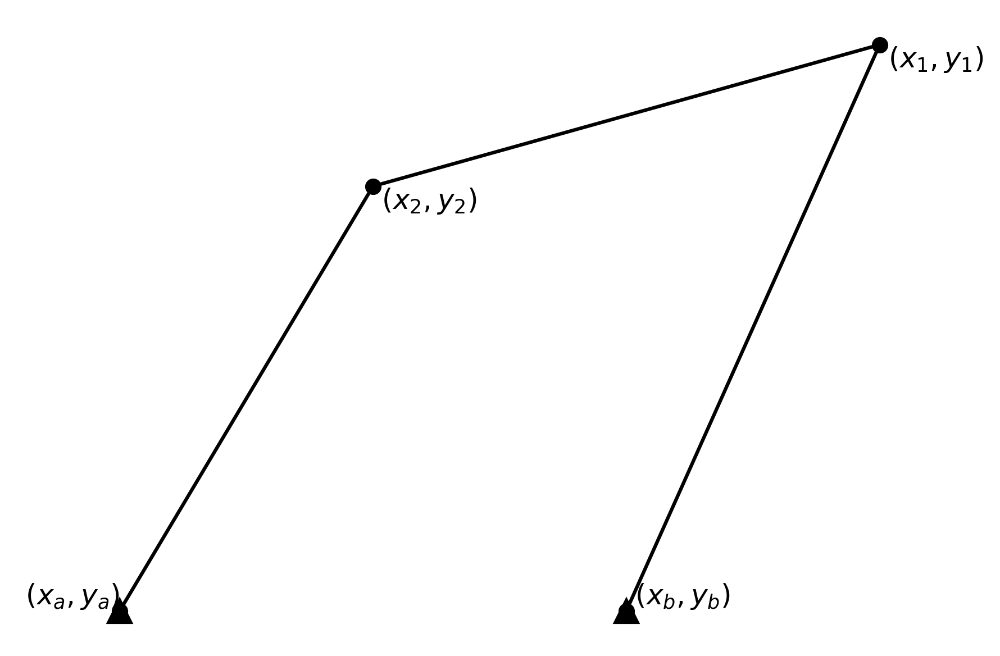
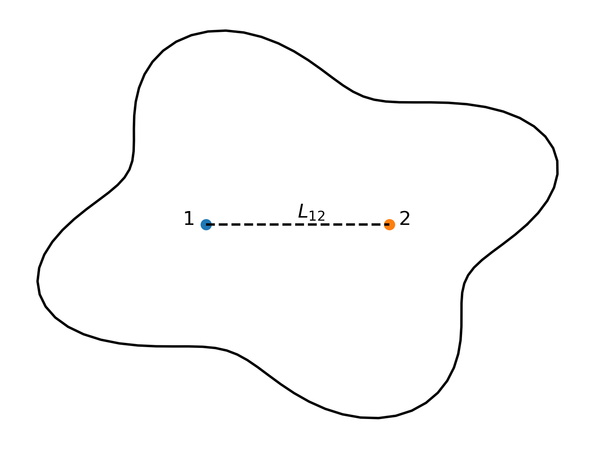
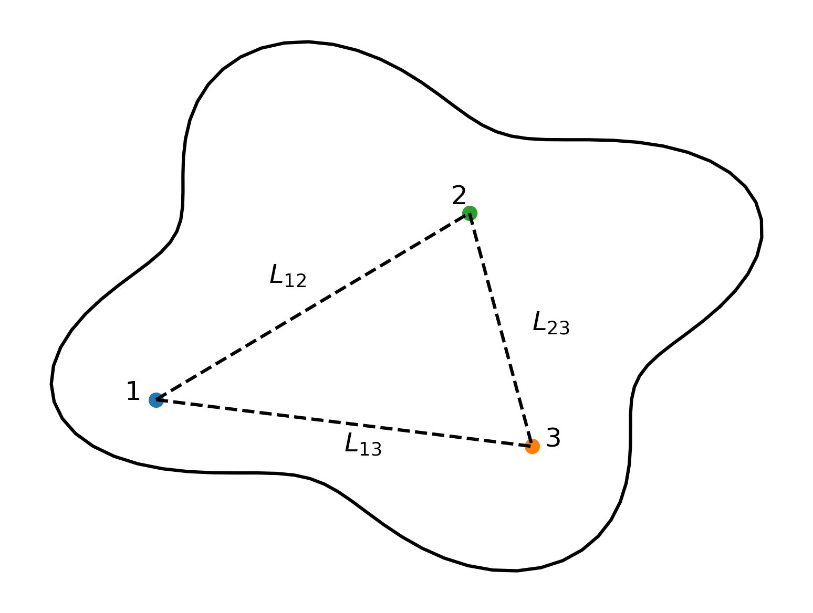
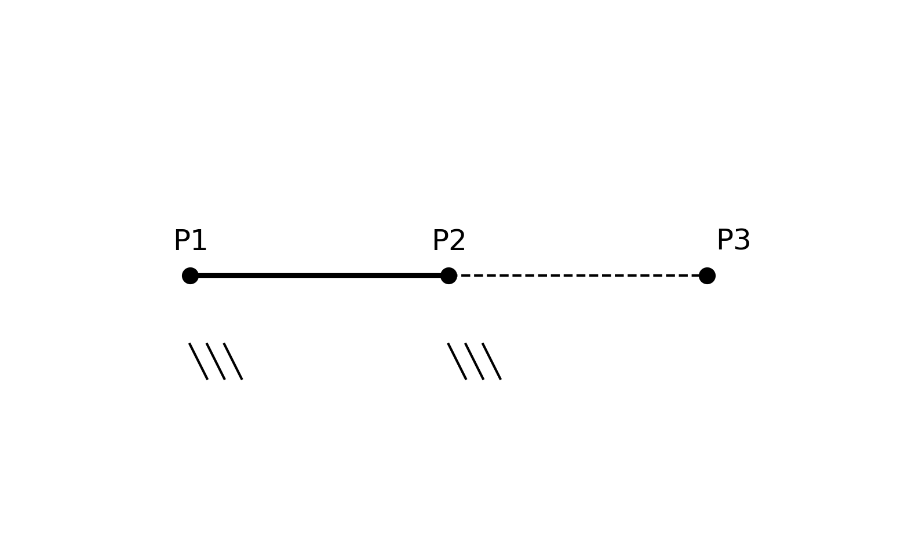

.. _theory_Kinematics:

Kinematics
==========

Introduction
------------
To perform a kinematic analysis, the first step is to define the initial position of the system. This involves providing the initial coordinates, for example, those relative to the wheel, frame, wishbone, steering, spring, among others, and a similar approach in the case of a motorcycle. Another important aspect is to establish the relationships between these elements by defining the suspension components through constraint equations. This section presents the theoretical approach used to derive the constraint equations in the models developed for analysing the relative motion of car suspension systems and motorcycles. Thus, it serves as a theoretical foundation for understanding these models.

Natural Coordinates 
-------------------
**Natural Coordinates** [deJalon1994]_: These coordinates independently define each element in the suspension system, with reference points located on the kinematic pairs. This approach eliminates the need for angular variables, offering several advantages:

- **Simple and Systematic Definition**: Each element is defined in a straightforward manner, making the overall system easier to understand and manage.
- **Easy Formulation of Constraint Equations**: Constraint equations are simpler to formulate, reducing the complexity of the mathematical model.
- **Independent Placement of Each Element**: Elements can be placed independently without interdependencies, allowing for greater flexibility in design.
- **No Trigonometric Functions**: The absence of trigonometric functions simplifies calculations, making the analysis more efficient.
- **Simplified Three-Dimensional Analyses**: Without the involvement of angular variables, three-dimensional analyses become more straightforward.

For example, a four-bar mechanism can be defined using natural coordinates, where each bar is defined by two points. The constraint equations are then used to define the rigidity of the system, ensuring the distances between these points remain constant. The system is defined with the fixed points $P_a$ and $P_b$, and the natural coordinates $x, y, z$ of the points $P_3$ and $P_4$.

Constraint Equations
--------------------
Below are the general type of the constraint equations used to define suspension systems are presented.

A solid modeled with two points has a total of 5 degrees of freedom, as the rotation around the line defined by the two points is undefined. This modeling approach is useful for defining elements in multibody systems where the moment of inertia about the axis of rotation is negligible or not required for the analysis.

This section focuses on the kinematic study of the system, specifically determining the positions of the defined natural coordinates. This modeling approach can be applied without limitation for practical purposes, as it is purely kinematic.

Solid Modeled with Two Points
^^^^^^^^^^^^^^^^^^^^^^^^^^^^^
For modeling, six natural coordinates are used, corresponding to the coordinates $x, y, z$ of each point $P_1$ and $P_2$. Since the solid has 5 degrees of freedom, only one constraint equation is needed to ensure the distance between points $P_1$ and $P_2$ remains constant, thereby defining the rigidity of the bar.

.. math::

    (x_2 - x_1)^2 + (y_2 - y_1)^2 + (z_2 - z_1)^2 - L_{12} = 0

Solid Modeled with Three Points
^^^^^^^^^^^^^^^^^^^^^^^^^^^^^^^
A solid can also be modeled with three points, resulting in a total of 9 natural coordinates. A solid in space has 6 degrees of freedom, so 3 constraint equations are required to ensure the distances between these points remain constant, defining the solid's rigidity.

The constraint equations are as follows:

.. math::

    (x_2 - x_1)^2 + (y_2 - y_1)^2 + (z_2 - z_1)^2 - L_{12} = 0

    (x_3 - x_1)^2 + (y_3 - y_1)^2 + (z_3 - z_1)^2 - L_{13} = 0

    (x_3 - x_2)^2 + (y_3 - y_2)^2 + (z_3 - z_2)^2 - L_{23} = 0

Adding More Points
^^^^^^^^^^^^^^^^^^
In some analyses, it may be useful to define a solid with more points. For instance, if a point $P_4$ is added to the previously defined solid, there will be 12 natural coordinates, requiring 6 constraint equations. This involves adding 3 equations to define the constant distance of $P_4$ with each of the previous points:

.. math::

    (x_4 - x_1)^2 + (y_4 - y_1)^2 + (z_4 - z_1)^2 - L_{14} = 0

    (x_4 - x_2)^2 + (y_4 - y_2)^2 + (z_4 - z_2)^2 - L_{24} = 0

    (x_4 - x_3)^2 + (y_4 - y_3)^2 + (z_4 - z_3)^2 - L_{34} = 0

To define a solid with an even greater number of points, the same procedure applies: establish a base with three points (3 constraint equations) and add 3 equations for each additional point, ensuring constant distances relative to the base.

.. note::

   Modeling a solid with three aligned points can result in dependent equations, potentially leading to simulation errors. To resolve this, either define different constraint equations accounting for alignment or adjust one of the points slightly out of alignment. Given the nature of suspension mechanisms, such cases do not need to be considered. However, if they arise, the position of one point can be approximated slightly out of alignment.

.. _section-convention-contrains:

Convention for Writing Proposals
^^^^^^^^^^^^^^^^^^^^^^^^^^^^^^^^
.. note::

   Imagine we want to define a constraint equation to indicate the constant distance between point $\alpha$ and point $\beta$. The constraint equation will be:

   .. math::

      (\alpha_x - \beta_x)^2 + (\alpha_y - \beta_y)^2 + (\alpha_z - \beta_z)^2 - L_{\beta_\alpha}^2 = 0

   where $x, y, z$ indicate the coordinates in each dimension and $L_{\beta_\alpha}$ is the constant distance between the points.

   So, to write the constraint equation in a clear way, it will be represented as:

   +--------------------+----------------------+--------------------------+
   | Constraint Equation| Initial Point        | Final Point              |
   +====================+======================+==========================+
   | example            | $\alpha$             | $\beta$                  |
   +--------------------+----------------------+--------------------------+

Aligned points
^^^^^^^^^^^^^^
In some cases, it may be necessary to define a rigid body using three aligned points. This can lead to dependent equations, which may cause numerical or simulation errors. To address this issue, one can either define alternative constraint equations that account for the alignment or slightly adjust one of the points to avoid perfect collinearity. However, given the nature of suspension mechanisms, such cases are typically not a concern. If they do arise, the position of one point can be slightly perturbed out of alignment to avoid simulation issues, or the constraint equations can be formulated in a way that accounts for the alignment, ensuring that the system remains stable during simulations.

This issue particularly affects classical motorcycle fork suspension systems, where the direction of wheel motion is constrained and the points are naturally aligned along that direction. In such cases, the constraint equations must be defined to explicitly account for this alignment, ensuring numerical stability during simulations.

Here, a system defined with three points is considered:

Note that points $P_1$ and $P_2$ are fixed, while point $P_3$ moves in the same direction as the line defined by $P_1$ and $P_2$. Therefore, the constraint equations are defined such that:

The direction of motion of $P_3$ is given by:

.. math::

    \vec{d} = (x_2 - x_1, y_2 - y_1, z_2 - z_1)
    

