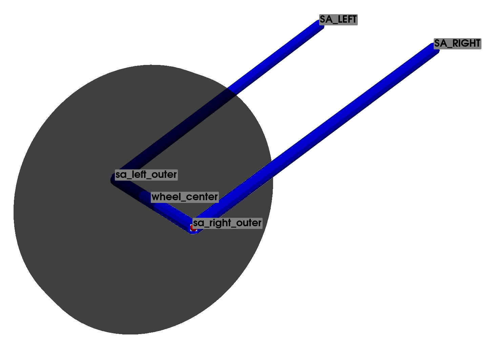
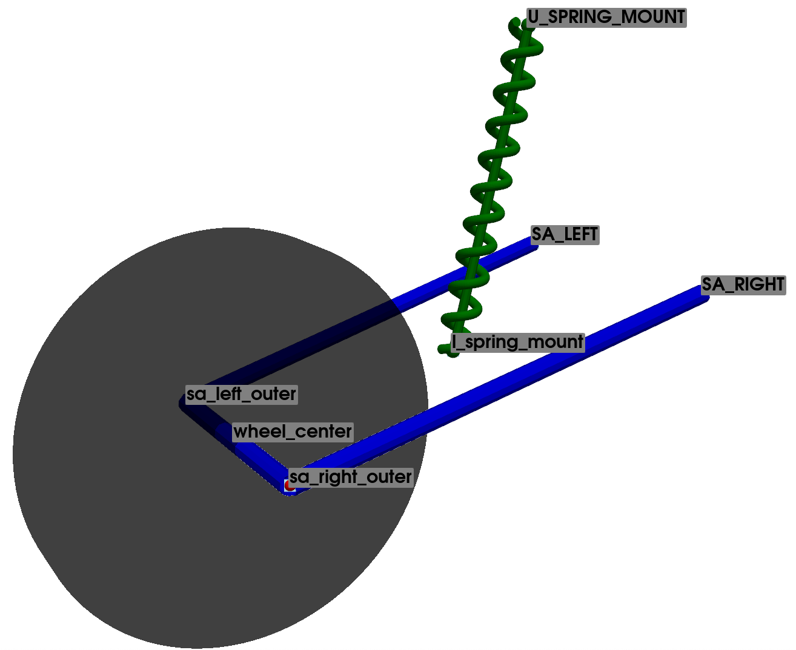

.. _motorbike_rear_assembly:

Rear Assembly
=============

The rear assembly is the section where the rear wheel is attached, serving as the principal connection between the rear wheel and the chassis. Several configurations and types can be found, with the most common being the swingarm, although other setups exist. In a classical swingarm setup, the arm rotates around a fixed pivot point, which defines the kinematic trajectory of the rear wheel. The suspension spring and damper can be arranged in various ways, such as a cantilever design, a four-bar linkage, or other configurations that are also supported for analysis.

Configuration: Base
-------------------

.. note::
    For an interactive visualization of the suspension, see the function :py:func:`pymycar.Cad.MotorCycle.rear_assembly.swingarm_cad_base`.

Note that the swingarm has a circular movement with respect to its attachment to the chassis. Consequently, it can be treated as a two-dimensional mechanism, kinematically defined with two points. However, for generality, a three-dimensional analysis is performed in this case to provide a robust base and a more comprehensive definition of the system, which will facilitate further analyses.

This base configuration solely considers the swingarm component, which governs the movement of the wheel relative to the chassis. Therefore, the suspension system is not considered in this specific step. 

The base system of the swingarm component is defined using 5 points, as presented in :ref:`table_points_description_motorbike_rear_assembly_swingarm`. Of these, 2 points represent the frame and are considered fixed, as the kinematic analysis is relative to these coordinates.

.. _table_points_description_motorbike_rear_assembly_swingarm:

.. table:: Points Defining the Base Swingarm Suspension

   +-----------------+--------------------------+--------+
   | Points  Name    | Description              | Type   |
   +=================+==========================+========+
   | wheel center    | Center of the wheel      | mobile |
   +-----------------+--------------------------+--------+
   | SA RIGHT        | Swingarm right           | fixed  |
   +-----------------+--------------------------+--------+
   | SA LEFT         | Swingarm left            | fixed  |
   +-----------------+--------------------------+--------+
   | sa right outer  | Swingarm right outer     | mobile |
   +-----------------+--------------------------+--------+
   | sa left outer   | Swingarm left outer      | mobile |
   +-----------------+--------------------------+--------+

The 8 constraint equations necessary to define the base system are presented in Table :ref:`table_constrains_equations_rear_assembly_swingarm_base`.

Note that all constraint equations are based on the Euclidean distance between two points, defined as the square root of the sum of the squared coordinate differences. By combining variants of this equation, it is possible to accurately declare and model frames, tie rods, wishbones, and all other components. The respective constraint equations will be represented as explained in :ref:`section-convention-contrains`.

.. _table_constrains_equations_rear_assembly_swingarm_base:

.. table:: Constraint Equations: Base Configuration Swingarm Suspension

    +---------+--------------------+-----------------+-----------------+
    |Equation | Part Definition    | Initial Point   | Final Point     |
    +=========+====================+=================+=================+
    | 1       | Swingarm           | sa right outer  | SA RIGHT        |
    +---------+--------------------+-----------------+-----------------+
    | 2       |                    | sa right outer  | SA LEFT         |
    +---------+--------------------+-----------------+-----------------+
    | 3       |                    | sa left outer   | SA LEFT         |
    +---------+--------------------+-----------------+-----------------+
    | 4       |                    | sa left outer   | SA RIGHT        |
    +---------+--------------------+-----------------+-----------------+
    | 5       |                    | sa left outer   | sa right outer  |
    +---------+--------------------+-----------------+-----------------+
    | 6       | Wheel Center       | wheel center    | SA LEFT         |
    +---------+--------------------+-----------------+-----------------+
    | 7       |                    | wheel center    | SA RIGHT        |
    +---------+--------------------+-----------------+-----------------+
    | 8       |                    | wheel center    | sa right outer  |
    +---------+--------------------+-----------------+-----------------+

Configuration: 1
----------------

.. note::
    For an interactive visualization of the suspension, see the function :py:func:`pymycar.Cad.MotorCycle.rear_assembly.rear_suspension_cantilever`.

In this configuration, the spring-damper assembly is introduced. The lower point of the suspension (*l spring mount*) is connected directly to the swingarm, while the other end (*U SPRING MOUNT*) is connected directly to the vehicle's chassis.

The system is defined using a total of 7 points, 3 of which represent the vehicle chassis and are considered fixed. It can be observed that the definition of this configuration is identical to the one used for the base system, with the addition of the connection point between the suspension and the swingarm (*l spring mount*), as well as the point *U SPRING MOUNT*, which anchors the opposite end of the suspension to the vehicle chassis (and subsequently will not dynamically influence the kinematic loop itself).

Therefore, the system has a total of 4 mobile points, resulting in a total of 12 natural coordinates.

Once again, the system possesses a single degree of freedom. Thus, a total of 11 constraint equations will be necessary. Of these, 8 equations represent the base of the suspension system, and the remaining 3 describe the proper rigid position of the *l spring mount* node on the main swingarm itself.

.. _table_points_description_motorbike_rear_assembly_swingarm_conf1:

.. table:: Points Defining the Swingarm Suspension Configuration 1

   +-----------------+--------------------------+--------+
   | Points  Name    | Description              | Type   |
   +=================+==========================+========+
   | wheel center    | Center of the wheel      | mobile |
   +-----------------+--------------------------+--------+
   | SA RIGHT        | Swingarm right           | fixed  |
   +-----------------+--------------------------+--------+
   | SA LEFT         | Swingarm left            | fixed  |
   +-----------------+--------------------------+--------+
   | sa right outer  | Swingarm right outer     | mobile |
   +-----------------+--------------------------+--------+
   | sa left outer   | Swingarm left outer      | mobile |
   +-----------------+--------------------------+--------+
   | U SPRING MOUNT  | Upper spring mount       | fixed  |
   +-----------------+--------------------------+--------+
   | l spring mount  | Lower spring mount       | mobile |
   +-----------------+--------------------------+--------+

.. _table_constrains_equations_rear_assembly_swingarm_configuration_1:

.. table:: Constraint Equations: Configuration 1 Swingarm Suspension

    +---------+--------------------+-----------------+-----------------+
    |Equation | Part Definition    | Initial Point   | Final Point     |
    +=========+====================+=================+=================+
    | 1       | Swingarm           | sa right outer  | SA RIGHT        |
    +---------+--------------------+-----------------+-----------------+
    | 2       |                    | sa right outer  | SA LEFT         |
    +---------+--------------------+-----------------+-----------------+
    | 3       |                    | sa left outer   | SA LEFT         |
    +---------+--------------------+-----------------+-----------------+
    | 4       |                    | sa left outer   | SA RIGHT        |
    +---------+--------------------+-----------------+-----------------+
    | 5       |                    | sa left outer   | sa right outer  |
    +---------+--------------------+-----------------+-----------------+
    | 6       | Wheel Center       | wheel center    | SA LEFT         |
    +---------+--------------------+-----------------+-----------------+
    | 7       |                    | wheel center    | SA RIGHT        |
    +---------+--------------------+-----------------+-----------------+
    | 8       |                    | wheel center    | sa right outer  |
    +---------+--------------------+-----------------+-----------------+ 
