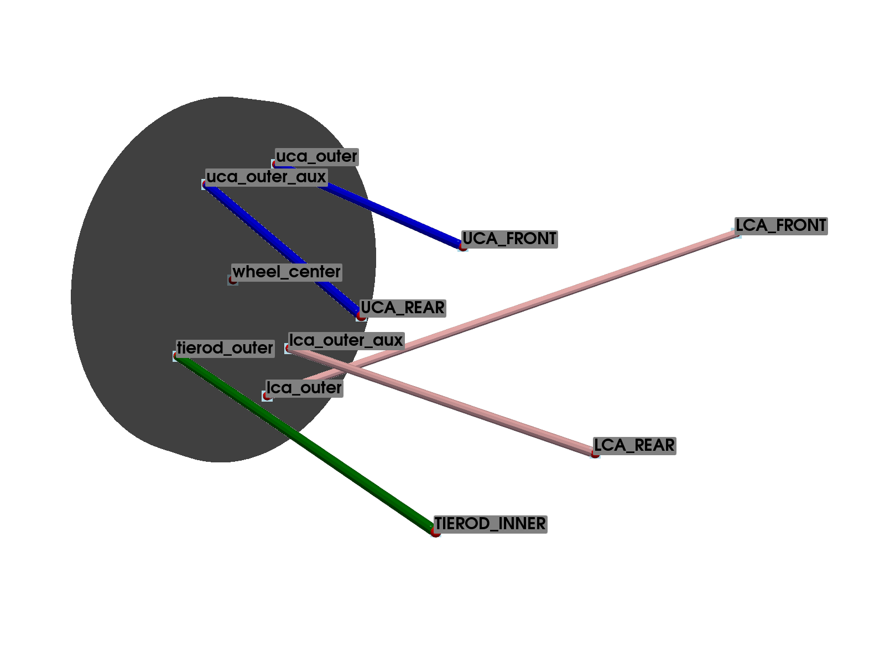
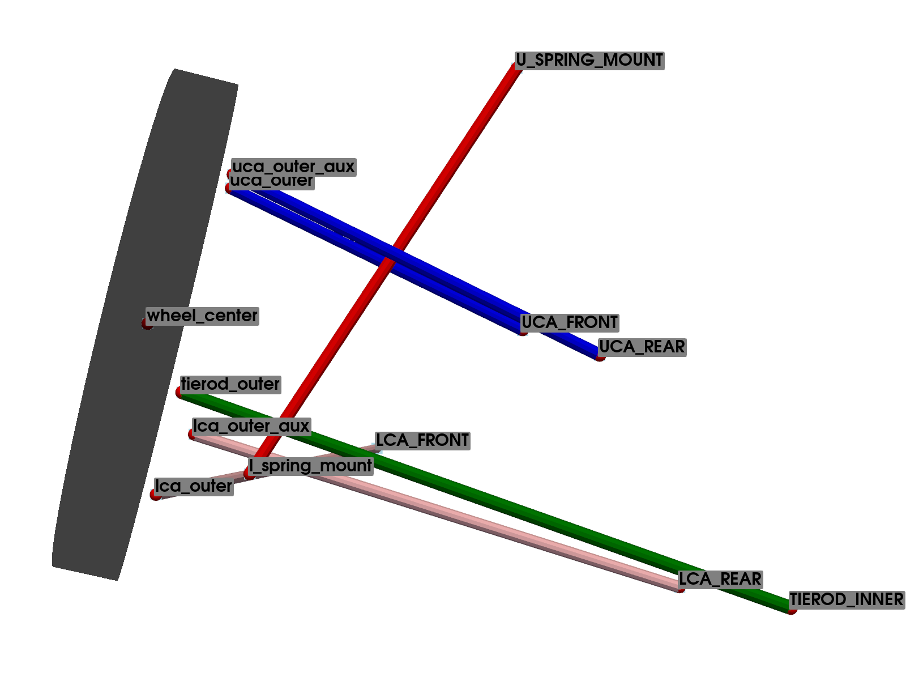

Multilink Suspension
====================

The multilink suspension is a type of suspension system that uses a series of arms to locate the wheel. This system is widely used in high-performance vehicles because it allows for better control of the wheel's movement, providing improved handling and comfort. The multilink suspension is complex, as it uses multiple arms to locate the wheel, which allows for precise control of the wheel's movement.

Key Components
^^^^^^^^^^^^^^
The multilink suspension can be viewed as a variation of the :ref:`double_whisbone_suspension`, where the *Upper Control Arm* and the *Lower Control Arm* are split into two bars.

* **Upper Control Arms (UCAs)**: The upper bars or control arms connect the upper part of the wheel hub to the vehicle chassis. They help control the vertical movement of the wheel and maintain the wheel's alignment.

* **Lower Control Arms (LCAs)**: The lower bars or control arms connect the lower part of the wheel hub to the vehicle chassis. They work in conjunction with the upper control arms to manage the wheel's movement and alignment.

* **Knuckle or Upright**: This component connects the upper and lower control arms to the wheel hub. It allows the wheel to pivot for steering and supports the wheel bearings.

* **Tie Rod**: In the case of front suspensions, the tie rod connects the steering rack to the wheel hub, allowing for steering input to be transmitted to the wheels.

* **Spring and Damper**: These components are crucial for absorbing shocks and maintaining ride comfort. The position of the spring and damper in the suspension system can be adapted to various configurations, meaning they can be placed in different locations depending on the design requirements.

Configuration: Base
-------------------

.. note::
    For an interactive visualization of the suspension, view the CAD example representation: :ref:`ref_cadsuspension_multilink_base`.

The base system of the Double Wishbone suspension is defined using 11 points, as presented in :ref:`table_points_description_multilink_base`. Of these, 6 points represent the vehicle chassis and are considered fixed, as the kinematic analysis is relative to these coordinates.

By convention, chassis points (fixed points) are named with letters (*UCA FRONT, UCA REAR, LCA FRONT, LCA REAR*), while mobile points are named with numbers (*uca outer, lca outer, tierod outer, uca outer aux, lca outer aux, wheel center*).

The *TIEROD INNER* point refers to the steering system (or toe link in the case of rear suspension), which is considered fixed in the analysis. Therefore, the system has a single degree of freedom, requiring a total of 11 constraint equations. To account for the steering behavior, several analyses must be conducted by varying this point's coordinates.

.. _table_points_description_multilink_base:

.. table:: Points Defining the Base Multilink Suspension

   +-----------------+--------------------------+--------+
   | Points  Name    | Description              | Type   |
   +=================+==========================+========+
   | wheel center    | Center of the Wheel      | mobile |
   +-----------------+--------------------------+--------+
   | UCA FRONT       | Upper Control Arm Front  | fixed  |
   +-----------------+--------------------------+--------+
   | UCA REAR        | Upper Control Arm Rear   | fixed  |
   +-----------------+--------------------------+--------+
   | uca outer       | Upper Control Arm Outer  | mobile |
   +-----------------+--------------------------+--------+
   | LCA FRONT       | Lower Control Arm Front  | fixed  |
   +-----------------+--------------------------+--------+
   | LCA REAR        | Lower Control Arm Rear   | fixed  |
   +-----------------+--------------------------+--------+
   | lca outer       | Lower Control Arm Outer  | mobile |
   +-----------------+--------------------------+--------+
   | TIEROD INNER    | Inner Tie Rod            | fixed  |
   +-----------------+--------------------------+--------+
   | tierod outer    | Outer Tie Rod            | mobile |
   +-----------------+--------------------------+--------+
   | uca outer aux   | Upper Control Arm Outer  | mobile |
   |                 | aux                      |        |
   +-----------------+--------------------------+--------+
   | lca outer aux   | Lower Control Arm Outer  | mobile |
   |                 | aux                      |        |
   +-----------------+--------------------------+--------+

The 17 constraint equations necessary to define the system are presented in table :ref:`table_constrains_equations_multilink_base`.

Note that all the constraint equations are based on the distance between two points, defined as the square root of the sum of the squares of the differences of the coordinates of the points. With this type of constraint equation, combining several types, it is possible to define the wishbones, tie rod, and all the components. The constraint equations will be represented as explained in :ref:`section-convention-contrains`.

.. _table_constrains_equations_multilink_base:

.. table:: Constraint Equations: Base Wishbone Suspension

    +---------+--------------------+-----------------+-----------------+
    |Equation | Part Definition    | Initial Point   | Final Point     |
    +=========+====================+=================+=================+
    | 1       |                    | uca outer       | UCA FRONT       |
    +---------+--------------------+-----------------+-----------------+
    | 2       |                    | uca outer aux   | UCA REAR        |
    +---------+--------------------+-----------------+-----------------+
    | 3       |                    | lca outer       | LCA FRONT       |
    +---------+--------------------+-----------------+-----------------+
    | 4       |                    | lca outer aux   | LCA REAR        |
    +---------+--------------------+-----------------+-----------------+
    | 5       |                    | tierod outer    | TIEROD INNER    |
    +---------+--------------------+-----------------+-----------------+
    | 6       |                    | lca outer       | uca outer       |
    +---------+--------------------+-----------------+-----------------+
    | 7       |                    | tierod outer    | uca outer       |
    +---------+--------------------+-----------------+-----------------+
    | 8       |                    | tierod outer    | lca outer       |
    +---------+--------------------+-----------------+-----------------+
    | 9       |                    | uca outer aux   | uca outer       |
    +---------+--------------------+-----------------+-----------------+
    | 10      |                    | uca outer aux   | lca outer       |
    +---------+--------------------+-----------------+-----------------+
    | 11      |                    | uca outer aux   | tierod outer    |
    +---------+--------------------+-----------------+-----------------+
    | 12      |                    | lca outer aux   | uca outer       |
    +---------+--------------------+-----------------+-----------------+
    | 13      |                    | lca outer aux   | lca outer       |
    +---------+--------------------+-----------------+-----------------+
    | 14      |                    | lca outer aux   | tierod outer    |
    +---------+--------------------+-----------------+-----------------+
    | 15      |                    | wheel center    | uca outer       |
    +---------+--------------------+-----------------+-----------------+
    | 16      |                    | wheel center    | lca outer       |
    +---------+--------------------+-----------------+-----------------+
    | 17      |                    | wheel center    | tierod outer    |
    +---------+--------------------+-----------------+-----------------+

Configuration: 1
----------------

.. note::
    For an interactive visualization of the suspension, view the CAD example representation: :ref:`ref_cad_suspension_multilink_configuration_1`.

In this configuration, the spring-damper assembly is introduced. The lower point of the suspension (*l spring mount*) is connected to the knuckle. The other end (*U SPRING MOUNT*) is connected directly to the vehicle chassis.

The system is defined by adding the equations that define the position of the connection point between the suspension and the knuckle to the base Multilink system equations.

.. _table_points_description_multilink_configuration_1:

.. table:: Points Defining the Multilink Suspension Configuration 1

   +-----------------+--------------------------+--------+
   | Points  Name    | Description              | Type   |
   +=================+==========================+========+
   | wheel center    | Center of the Wheel      | mobile |
   +-----------------+--------------------------+--------+
   | UCA FRONT       | Upper Control Arm Front  | fixed  |
   +-----------------+--------------------------+--------+
   | UCA REAR        | Upper Control Arm Rear   | fixed  |
   +-----------------+--------------------------+--------+
   | uca outer       | Upper Control Arm Outer  | mobile |
   +-----------------+--------------------------+--------+
   | LCA FRONT       | Lower Control Arm Front  | fixed  |
   +-----------------+--------------------------+--------+
   | LCA REAR        | Lower Control Arm Rear   | fixed  |
   +-----------------+--------------------------+--------+
   | lca outer       | Lower Control Arm Outer  | mobile |
   +-----------------+--------------------------+--------+
   | TIEROD INNER    | Inner Tie Rod            | fixed  |
   +-----------------+--------------------------+--------+
   | tierod outer    | Outer Tie Rod            | mobile |
   +-----------------+--------------------------+--------+
   | uca outer aux   | Upper Control Arm Outer  | mobile |
   |                 | aux                      |        |
   +-----------------+--------------------------+--------+
   | lca outer aux   | Lower Control Arm Outer  | mobile |
   |                 | aux                      |        |
   +-----------------+--------------------------+--------+

.. _table_constrains_equations_multilink_configuration_1:

.. table:: Constraint Equations: Configuration 1 Multilink Suspension

    +---------+--------------------+-----------------+-----------------+
    |Equation | Part Definition    | Initial Point   | Final Point     |
    +=========+====================+=================+=================+
    | 1       |                    | uca outer       | UCA FRONT       |
    +---------+--------------------+-----------------+-----------------+
    | 2       |                    | uca outer aux   | UCA REAR        |
    +---------+--------------------+-----------------+-----------------+
    | 3       |                    | lca outer       | LCA FRONT       |
    +---------+--------------------+-----------------+-----------------+
    | 4       |                    | lca outer aux   | LCA REAR        |
    +---------+--------------------+-----------------+-----------------+
    | 5       |                    | tierod outer    | TIEROD INNER    |
    +---------+--------------------+-----------------+-----------------+
    | 6       |                    | lca outer       | uca outer       |
    +---------+--------------------+-----------------+-----------------+
    | 7       |                    | tierod outer    | uca outer       |
    +---------+--------------------+-----------------+-----------------+
    | 8       |                    | tierod outer    | lca outer       |
    +---------+--------------------+-----------------+-----------------+
    | 9       |                    | uca outer aux   | uca outer       |
    +---------+--------------------+-----------------+-----------------+
    | 10      |                    | uca outer aux   | lca outer       |
    +---------+--------------------+-----------------+-----------------+
    | 11      |                    | uca outer aux   | tierod outer    |
    +---------+--------------------+-----------------+-----------------+
    | 12      |                    | lca outer aux   | uca outer       |
    +---------+--------------------+-----------------+-----------------+
    | 13      |                    | lca outer aux   | lca outer       |
    +---------+--------------------+-----------------+-----------------+
    | 14      |                    | lca outer aux   | tierod outer    |
    +---------+--------------------+-----------------+-----------------+
    | 15      |                    | wheel center    | uca outer       |
    +---------+--------------------+-----------------+-----------------+
    | 16      |                    | wheel center    | lca outer       |
    +---------+--------------------+-----------------+-----------------+
    | 17      |                    | wheel center    | tierod outer    |
    +---------+--------------------+-----------------+-----------------+
    | 18      |                    | Spring/Damper   | uca outer       |
    |         |                    | Lower Mount     |                 |
    +---------+--------------------+-----------------+-----------------+
    | 19      |                    | Spring/Damper   | lca outer       |
    |         |                    | Lower Mount     |                 |
    +---------+--------------------+-----------------+-----------------+
    | 20      |                    | Spring/Damper   | tierod outer    |
    |         |                    | Lower Mount     |                 |
    +---------+--------------------+-----------------+-----------------+
