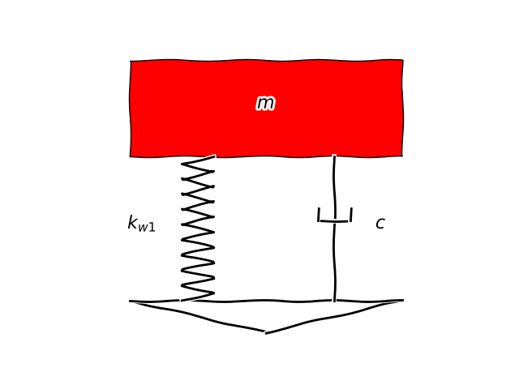
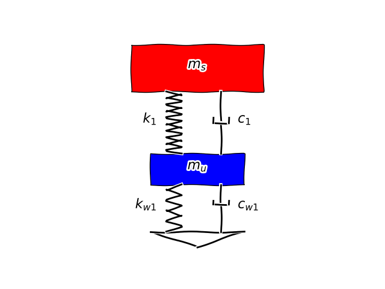

.. _theory_quarter_car_model:

Quarter car model
=================

The significant advantage of this model is its simplicity compared to other models. It allows for a detailed study of a specific part of the vehicle, thereby understanding the phenomenon at hand.

It enables an analysis of a specific part of the vehicle, precisely a quarter of it. This study focuses on the behavior of a single suspension system.

Two models are presented for this purpose: one with a single degree of freedom and another with two degrees of freedom.

One degree of freedom
---------------------

.. code-block::

    #        ---------------       ^
    #        |             |       | z
    #        |      m      |       _
    #        |             |      
    #        ---------------
    #           \       |
    #        k  /      |_| c
    #           \       |
    #           ---------
    #             \   /
    #               *    __      __     ^    
    #       ____________/  \    /  \__  | z0
    #                       \__/

A single mass is considered, which can be approximated as a quarter of the total vehicle mass.

The degree of freedom of the system, denoted in as $Z$ , describes the vertical motion of the suspended mass. The system is excited by a displacement $Z_0$ applied at its base.

.. math::
    q = (Z)

and 

.. math::
    \dot{q} = (\dot{Z})

System Parameters for the Quarter Car Model with One Degree of Freedom
----------------------------------------------------------------------

.. table::

    +-----------------------------+-------------------+
    | **Parameters: 1 Degree of   |                   |
    | Freedom Car Quarter**       |                   |
    +-----------------------------+-------------------+
    | $m$                         | Mass              |
    +-----------------------------+-------------------+
    | $k$                         | Spring Stiffness  |
    +-----------------------------+-------------------+
    | $c$                         | Damping           |
    +-----------------------------+-------------------+

* The kinetic energy `T` 
.. math::
    T = \frac{1}{2}m{\dot{z}}^2

* potential energy `V`
.. math::
    V = \frac{1}{2}k(z-z_0)^2

* dissipated energy `R`
.. math::
    R = \frac{1}{2}c(\dot{z}-\dot{z_0})^2

Applying the lagrange equation :eq:`lagrange_equation` to the degree of freedom in question yields the differential equation of the system:

.. math::
    m\ddot{z}+c(\dot{z}-\dot{z_0})+k(z-z_0)=0

By separating the excitation forces, it can be represented as:

.. math::

    m\ddot{z}+c\dot{z}+kz = c\dot{z_0}+kz_0

Two degree of freedom
---------------------

.. code-block::

    #     --------------------     ^
    #     |                  |     | zs
    #     |        ms        |    --- 
    #     |                  |    
    #     --------------------
    #           \       |
    #       k1  /      |_| c1
    #           \       |
    #        ---------------       ^
    #        |             |       | zu
    #        |     mu      |      ---
    #        |             |      
    #        ---------------
    #           \       |
    #       kw1 /      |_| cw1
    #           \       |
    #           ---------
    #             \   /
    #               *    __      __     ^    
    #       ____________/  \    /  \__  | z0
    #                       \__/

This model introduces an unsprung mass, primarily representing the wheel mass. The sprung mass includes the vehicle chassis and its components, as well as the driver and passengers.

There are two degrees of freedom, denoted as $Z_s$ and $Z_u$, corresponding to the vertical displacements of the sprung and unsprung masses, respectively.

.. math::
    q = (Z_s, Z_u)

and 

.. math::
    \dot{q} = (\dot{Z_s}, \dot{Z_u})

System Parameters for the Quarter Car Model with Two Degrees of Freedom
-----------------------------------------------------------------------

.. table::

    +-----------------------------+-------------------+
    | **Parameters: 2 Degrees of  |                   |
    | Freedom Car Quarter**       |                   |
    +-----------------------------+-------------------+
    | $m_s$                       | Unsprung Mass     |
    +-----------------------------+-------------------+
    | $m_u$                       | Unsprung Mass     |
    +-----------------------------+-------------------+
    | $k_1$                       | Suspension        |
    |                             | Stiffness         |
    +-----------------------------+-------------------+
    | $c_1$                       | Suspension        |
    |                             | Damping           |
    +-----------------------------+-------------------+
    | $k_w1$                      | Tire Stiffness    |
    +-----------------------------+-------------------+
    | $c_w1$                      | Tire Damping      |
    +-----------------------------+-------------------+

The kinetic energy $T$, dissipated energy $R$, and potential energy $V$ are defined as follows:

.. math::
    T = \frac{1}{2}m_s{\dot{z_s}}^2 + \frac{1}{2}m_u{\dot{z_u}}^2

.. math::
    V = \frac{1}{2}k_1(z_s-z_u)^2 + \frac{1}{2}k_{w1}(z_u-z_0)^2

.. math::
    R = \frac{1}{2}c_1(\dot{z_s}-\dot{z_u})^2 + \frac{1}{2}c_{w1}(\dot{z_u}-\dot{z_0})^2

Applying the Lagrange equation :eq:`lagrange_equation` to the system's degrees of freedom results in two differential equations that define the system:

.. math::
    m_s\ddot{z_s} + c_1(\dot{z_s}-\dot{z_u}) + k(z_s-z_u) = 0

.. math::
    m_u\ddot{z_u} - c_1(\dot{z_s}-\dot{z_u}) + c_{w1}(\dot{z_u}-\dot{z_0}) - k(z_s-z_u) + k_{w1}(z_u-z_0) = 0

Matrix Representation
---------------------

The two coupled differential equations describing the system can be conveniently expressed in matrix form as follows:

.. math::

    [M]{\{\ddot{q}\}} + [C]{\{\dot{q}\}} + [K]{\{q\}} = {F}

Where:

.. math::
    M = \begin{bmatrix}
        m_s & 0 \\
        0   & m_u \\
    \end{bmatrix}

.. math::
    C = \begin{bmatrix}
        c_1 & -c_1 \\
        -c_1   & c_1+c_{w1} \\
    \end{bmatrix}

.. math::
    K = \begin{bmatrix}
        k_1 & -k_1 \\
        -k_1   & k_1+k_{w1} \\
    \end{bmatrix}

.. math::
    F = \begin{Bmatrix}
        0 \\
        c_{w1}\dot{z_0}+k_w z_0 \\
    \end{Bmatrix}

And the vector `q` is defined as:

.. math:: 

    q = \left\{\begin{array}{cccc}
            Z_s \\
            Z_u
        \end{array}\right\}
